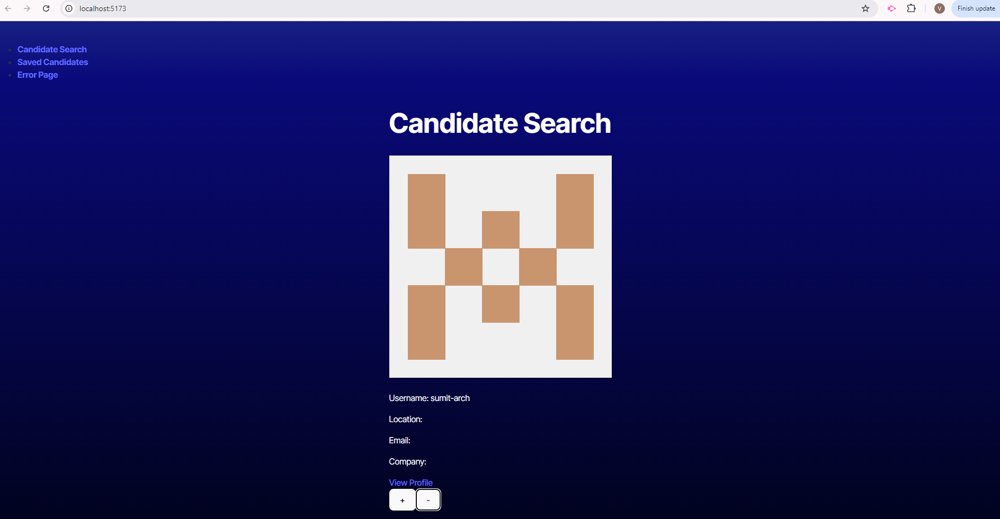

# Candidate Search Application


## Description

This is a React application that allows users to search for GitHub users and view their details. The application fetches GitHub user data using the GitHub API and displays one user at a time.

## Table of Contents

- [Installation](#installation)
- [Usage](#usage)
- [Features](#features)
- [Credits](#credits)
- [License](#license)
- [Badges](#badges)
- [How to Contribute](#how-to-contribute)
- [Questions](#questions)

## Installation

### Prerequisites

- Node.js (v14 or higher)
- npm (v6 or higher) or yarn (v1.22 or higher)
- GitHub Personal Access Token

### Steps

1. **Clone the Repository**

  ```bash
  git clone https://github.com/your-username/candidate-search.git
  cd candidate-search
  ```

2. **Install Dependencies**

  Using npm:

  ```bash
  npm install
  ```

  Using yarn:

  ```bash
  yarn install
  ```

3. **Set Up Environment Variables**

  Create a [`.env`](command:_github.copilot.openRelativePath?%5B%7B%22scheme%22%3A%22file%22%2C%22authority%22%3A%22%22%2C%22path%22%3A%22%2FC%3A%2FUsers%2Fvicto%2Fbootcamp%2FCandidate-Search%2F.env%22%2C%22query%22%3A%22%22%2C%22fragment%22%3A%22%22%7D%5D "c:\Users\victo\bootcamp\Candidate-Search\.env") file in the root directory of the project and add your GitHub Personal Access Token:

  ```properties
  VITE_GITHUB_TOKEN=your_github_token_here
  ```

4. **Start the Development Server**

  Using npm:

  ```bash
  npm run dev
  ```

5. **Build for Production**

  Using npm:

  ```bash
  npm run build
  ```

6. **Preview the Production Build**

  Using npm:

  ```bash
  npm run preview
  ```


## Usage

Once the development server is running, you can open your browser and navigate to `http://localhost:3000` to use the application. The application will fetch and display GitHub users one at a time, showing their name, username, location, avatar, email, HTML URL, and company.



## Features

- Fetch and display GitHub users one at a time.
- Display user details including name, username, location, avatar, email, HTML URL, and company.
- Save users to local storage.

## Credits

- [Victor Roman](https://github.com/Romantech91)

## License

This project is licensed under the MIT License. See the [`LICENSE`](command:_github.copilot.openRelativePath?%5B%7B%22scheme%22%3A%22file%22%2C%22authority%22%3A%22%22%2C%22path%22%3A%22%2FC%3A%2FUsers%2Fvicto%2Fbootcamp%2FCandidate-Search%2FLICENSE%22%2C%22query%22%3A%22%22%2C%22fragment%22%3A%22%22%7D%5D "c:\Users\victo\bootcamp\Candidate-Search\LICENSE") file for details.

## Badges


## How to Contribute

Contributions are welcome! Please follow these steps:

1. Fork the repository.
2. Create a new branch (`git checkout -b feature-branch`).
3. Make your changes.
4. Commit your changes (`git commit -m 'Add some feature'`).
5. Push to the branch (`git push origin feature-branch`).
6. Open a pull request.

## Questions

If you have any questions, please open an issue or contact me directly at [your-email@example.com](mailto:your-email@example.com).

## Vite Configuration

The Vite configuration for this project is as follows:

```typescript
import { defineConfig } from 'vite';
import react from '@vitejs/plugin-react';

// https://vitejs.dev/config/
export default defineConfig({
  plugins: [react()],
});